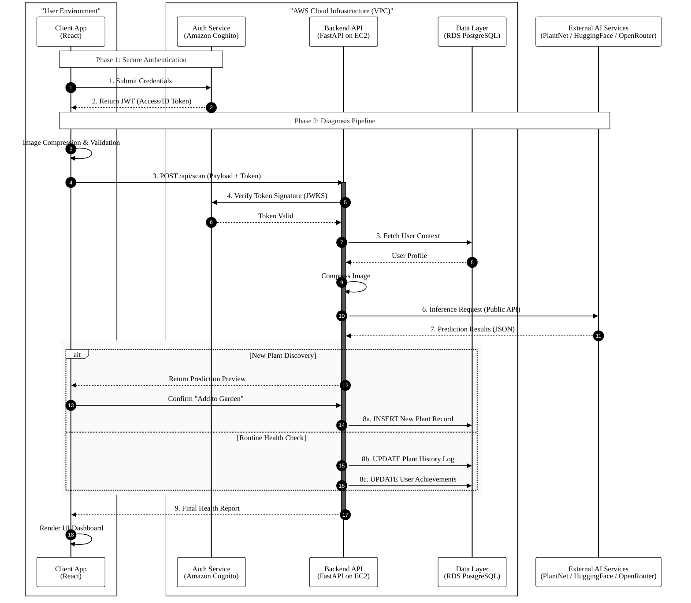

```mermaid
%%{init: {
  'theme': 'base',
  'themeVariables': {
    'fontFamily': 'Arial, Helvetica, sans-serif',
    'fontSize': '13px',
    'primaryColor': '#ffffff',
    'primaryBorderColor': '#000000',
    'primaryTextColor': '#000000',
    'lineColor': '#000000',
    'secondaryColor': '#f4f4f4',
    'tertiaryColor': '#fff',
    'noteBkgColor': '#ffffff', 
    'noteBorderColor': '#000000',
    'sequenceNumberColor': '#ffffff',
    'sequenceNumberBgColor': '#000000',
    'actorBorder': '#000000',
    'activationBorderColor': '#000000',
    'activationBkgColor': '#555555',
    'loopTextColor': '#000000'
  }
}}%%

sequenceDiagram
    autonumber
    
    %% 1. Client Zone
    box "User Environment" #F9F9F9
    participant C as Client App<br/>(React)
    end
    
    %% 2. AWS Cloud
    box "AWS Cloud Infrastructure (VPC)" #F4F6F8
    participant A as Auth Service<br/>(Amazon Cognito)
    participant B as Backend API<br/>(FastAPI on EC2)
    participant D as Data Layer<br/>(RDS PostgreSQL)
    end

    %% 3. External AI
    participant E as External AI Services<br/>(PlantNet / HuggingFace / OpenRouter)

    %% --- Flow ---
    Note over C, A: Phase 1: Secure Authentication
    C->>A: 1. Submit Credentials
    A-->>C: 2. Return JWT (Access/ID Token)
    
    Note over C, E: Phase 2: Diagnosis Pipeline
    C->>C: Image Compression & Validation
    C->>B: 3. POST /api/scan (Payload + Token)
    
    activate B
    B->>A: 4. Verify Token Signature (JWKS)
    A-->>B: Token Valid
    
    B->>D: 5. Fetch User Context
    D-->>B: User Profile
    
    B->>B: Compress Image
    
    %% External AI calls (Public Internet)
    B->>E: 6. Inference Request (Public API)
    E-->>B: 7. Prediction Results (JSON)
    
    %% Branch logic
    rect rgb(250, 250, 250)
        alt New Plant Discovery
            B-->>C: Return Prediction Preview
            C->>B: Confirm "Add to Garden"
            B->>D: 8a. INSERT New Plant Record
        else Routine Health Check
            B->>D: 8b. UPDATE Plant History Log
            B->>D: 8c. UPDATE User Achievements
        end
    end
    
    B-->>C: 9. Final Health Report
    deactivate B
    
    C->>C: Render UI Dashboard
```